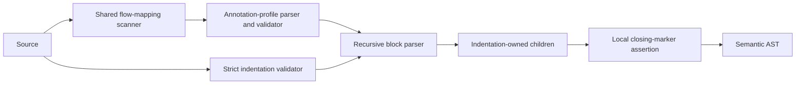
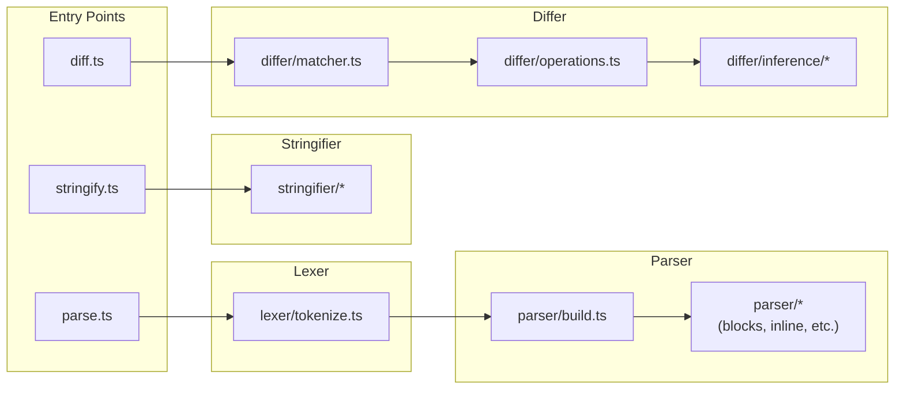
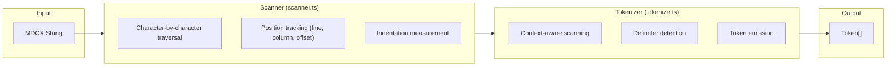
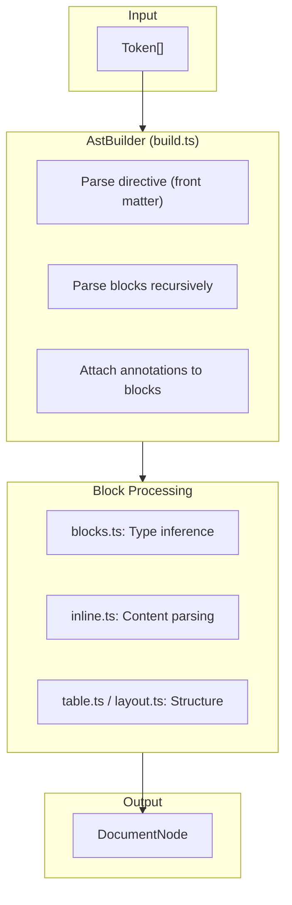
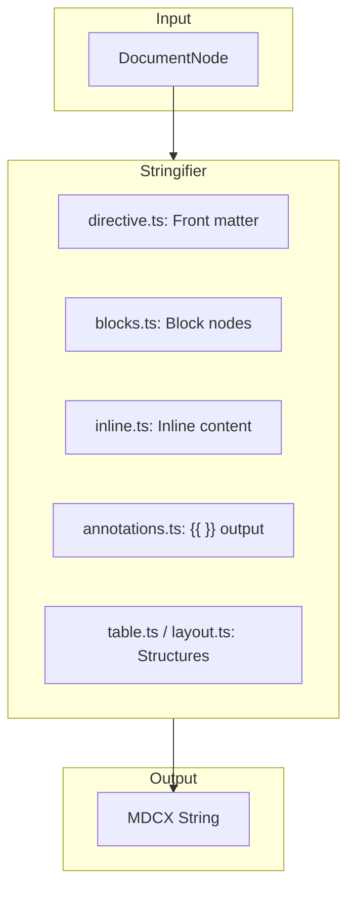
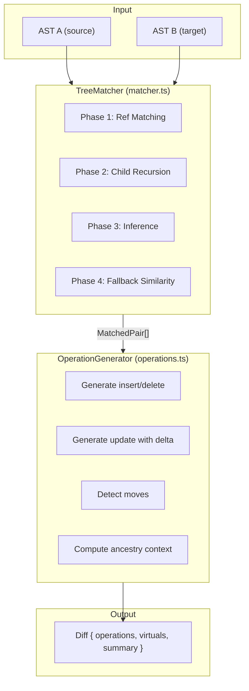

# Architecture Guide

<br/>

This document explains the internal architecture of mdc for contributors and maintainers. MDCX is a CommonMark syntax extension where implemented, built with a purpose-specific TypeScript lexer and recursive-descent parser rather than mdast, unified, or another Markdown parser. For user-facing documentation covering API, syntax, and usage, see [README.md](./README.md).

<br/>
<div align="center">

&bull;&emsp;&emsp;[Overview](#-overview)&emsp;&emsp;&bull;&emsp;&emsp;[Pipeline](#-processing-pipeline)&emsp;&emsp;&bull;&emsp;&emsp;[Modules](#-module-structure)&emsp;&emsp;&bull;&emsp;&emsp;[Virtual Refs](#-virtual-references)&emsp;&emsp;&bull;&emsp;&emsp;[Components](#-component-details)&emsp;&emsp;&bull;&emsp;&emsp;[Decisions](#-design-decisions)&emsp;&emsp;&bull;

</div>
<br/>

---

## 📖 Overview

mdc processes MDCX documents through a series of transformations, converting between text, tokens, and Abstract Syntax Trees. The architecture follows a **separation of concerns** principle:

- **Lexer**: Text → Tokens (delimiter-focused, balanced annotation scanning, strict indentation validation)
- **Annotation Profile**: Flow mapping → validated JSON-compatible annotations
- **Parser**: Tokens → AST (recursive descent with exact indentation-owned hierarchy and local marker assertions)
- **Recovery**: Source/tokens → deterministic normalization plus diagnostics, only when explicitly requested
- **Stringifier**: AST → canonical text (structural closing-marker policy)
- **Differ**: AST × AST → Operations (semantic change detection)

Each module operates on well-defined input/output types, enabling composition and testability.

---

## 🔄 Processing Pipeline

````mermaid
flowchart TD
    subgraph Input
        MDCX[/"MDCX Document"/]
    end

    subgraph Lexer["LEXER"]
        direction TB
        L1["Delimiter-focused scan"]
        L2["Identifies: {{ }}, ---, ```, content"]
    end

    TOKENS[/"Token Stream<br/>[ANNOTATION_START, CONTENT, ...]"/]

    subgraph Parser["PARSER"]
        direction TB
        P1["Recursive descent build"]
        P2["Infers: heading, paragraph,<br/>bullet, table, layout, etc."]
    end

    AST[("DocumentNode (AST)<br/>{ type, annotations, children }")]

    subgraph Stringifier["STRINGIFIER"]
        direction TB
        S1["AST → MDCX text"]
        S2["Options:<br/>• omitAnnotations<br/>• format callback"]
    end

    subgraph Differ["DIFFER"]
        direction TB
        D1["AST A × AST B"]
        D2["4-Phase Pipeline:<br/>1. Ref matching<br/>2. Child recursion<br/>3. Inference<br/>4. Similarity"]
    end

    MDCX2[/"MDCX Document"/]
    DIFF[/"Diff { operations, virtuals }<br/>[insert, delete, update, move]"/]

    MDCX --> Lexer
    Lexer --> TOKENS
    TOKENS --> Parser
    Parser --> AST
    AST --> Stringifier
    AST --> Differ
    Stringifier --> MDCX2
    Differ --> DIFF
````

The MDCX-specific structural path is deliberately one-way in strict mode:



Strict parsing never scans arbitrary future tokens to decide hierarchy. The block body and exact-indentation children are built first; only the next local marker can then verify that completed structure. Recovery adds a one-pass marker index and diagnostic sink before strict parsing, but only for explicit `mode: 'recover'` calls.

### Data Flow Summary

| Stage     | Input              | Output         | Key Responsibility                                                          |
| --------- | ------------------ | -------------- | --------------------------------------------------------------------------- |
| Tokenize  | `string`           | `Token[]`      | Identify MDCX delimiters, scan mappings, validate indentation               |
| Build AST | `Token[]`          | `DocumentNode` | Construct typed hierarchy from exact indentation and locally verify markers |
| Stringify | `DocumentNode`     | `string`       | Convert the semantic AST to canonical MDCX                                  |
| Diff      | `DocumentNode × 2` | `Diff`         | Compute semantic changes with ancestry                                      |

---

## 📦 Module Structure

```plain
src/
├── lexer/                    # Phase 1: Delimiter-focused tokenization
│   ├── flow-mapping.ts       # Shared balanced, quote-aware flow scanner
│   ├── scanner.ts            # Character-by-character position tracking
│   ├── tokenize-annotations.ts # Annotation and closing-marker tokenization
│   ├── tokenize.ts           # Main tokenization loop
│   └── types.ts              # Token, TokenType definitions
│
├── parser/                   # Phase 2: Recursive descent AST builder
│   ├── annotation-profile.ts # YAML document parsing and canonical output
│   ├── annotation-profile-validation.ts # Node-tree profile validation
│   ├── annotation-profile-runtime.ts # JSON-compatible runtime validation
│   ├── block-parser.ts       # Exact-indentation recursive block parser
│   ├── build.ts              # Token → AST orchestration
│   ├── blocks.ts             # Block type inference (heading, list, etc.)
│   ├── inline.ts             # Inline content (links, media, formatting)
│   ├── directive.ts          # Front matter handling
│   ├── closing.ts            # Parsed local marker assertions
│   ├── diagnostics.ts        # Recovery configuration and warning sink
│   ├── marker-index.ts       # Recovery-only one-pass marker pairing
│   ├── recovery.ts           # Deterministic recovery orchestration
│   ├── recovery-source.ts    # Source indentation normalization
│   ├── recovery-tokens.ts    # Marker scope and skipped-level repairs
│   ├── token-cursor.ts       # Linear token cursor
│   ├── inference.ts          # Block type inference logic
│   ├── layout.ts             # Layout/column parsing
│   ├── position.ts           # Position tracking utilities
│   ├── table.ts              # Table structure parsing
│   └── types.ts              # ParseOptions, OnContentContext
│
├── stringifier/              # Phase 3: AST to MDCX string
│   ├── blocks.ts             # Block node serialization
│   ├── inline.ts             # Inline node serialization
│   ├── annotations.ts        # Annotation output
│   ├── directive.ts          # Front matter output
│   ├── inference.ts          # Type inference for output
│   ├── layout.ts             # Layout structure output
│   ├── table.ts              # Table structure output
│   ├── utilities.ts          # Stringifier helpers
│   └── types.ts              # StringifyOptions
│
├── differ/                   # Phase 4: Semantic diff engine
│   ├── matcher.ts            # TreeMatcher: 4-phase matching pipeline
│   ├── operations.ts         # OperationGenerator: diff operation creation
│   ├── ref.ts                # Virtual ref generation (#prefix)
│   ├── delta.ts              # Property delta computation
│   ├── traversal.ts          # AST traversal utilities
│   ├── similarity.ts         # Weighted similarity scoring
│   ├── fallback.ts           # Greedy similarity matching
│   ├── text.ts               # Text extraction for similarity scoring
│   ├── utilities.ts          # Comparison helpers
│   ├── matcher/              # Child, remaining-node, and match-state helpers
│   └── inference/            # 4 matching strategies
│       ├── index.ts          # Strategy orchestration
│       ├── positional.ts     # Position-based (highest confidence)
│       ├── content.ts        # Text similarity
│       ├── structural.ts     # Type uniqueness
│       ├── fingerprint.ts    # Context patterns (lowest confidence)
│       ├── utilities.ts      # Inference helpers
│       └── types.ts          # Strategy types
│
├── types/                    # Shared type definitions
│   ├── ast.ts                # DocumentNode, BlockNode, InlineNode
│   ├── diff.ts               # Diff, DiffOperation
│   └── index.ts              # Re-exports
│
├── parse.ts                  # Public parse() entry point
├── stringify.ts              # Public stringify() entry point
├── diff.ts                   # Public diff() entry point
├── errors.ts                 # ParseError class
└── index.ts                  # Public exports
```

### Module Dependencies



---

## 🔑 Virtual References

Virtual references are **auto-generated identifiers** for nodes that lack explicit `ref` attributes. They enable the differ to track node identity and provide ancestry context without requiring users to annotate every block.

### What They Are

- **Format**: `#<base36-encoded-random>` (e.g., `#k5f8x2p9a3m1`)
- **Prefix**: The `#` character distinguishes virtual refs from user-defined refs
- **Generation**: 64-bit cryptographically random value encoded in base36

```typescript
// src/differ/ref.ts
export function generateLocalRef(): string {
  const bytes = randomBytes(8); // 64 bits
  const base36 = bytes.readBigUInt64BE().toString(36);
  return `#${base36}`;
}
```

### When They're Generated

Virtual refs are generated **only during diff operations**, never during parsing or stringification:

1. **Ancestry Context**: When computing `parentRefs` and `afterRef` for operations, ancestors without explicit refs receive virtual refs
2. **Update Operations**: When positionally-matched nodes differ in content, the update operation receives a virtual ref
3. **Insert Operations**: When inserted nodes are ancestors of other inserted nodes, they receive virtual refs so children can reference them via `parentRefs`
4. **Delete/Move Operations**: When deleted or moved source nodes have no explicit refs, source-side virtual refs are materialized so operation identity remains source-anchored

```typescript
// TreeMatcher#getOrCreateRef - generates virtual refs for ancestry chain
#getOrCreateRef(node: BlockNode, isSource = false): string {
  if (node.ref) return node.ref;           // explicit ref preferred
  const cached = this.#virtualRefMap.get(node);
  if (cached) return cached;               // reuse cached virtual ref
  const virtualRef = generateLocalRef();
  this.#virtualRefMap.set(node, virtualRef);
  if (isSource) this.#virtuals.set(virtualRef, node); // track source node
  return virtualRef;
}

// TreeMatcher#getVirtualRef - exposes cached virtual refs to OperationGenerator
public getVirtualRef(node: BlockNode): string | undefined {
  return this.#virtualRefMap.get(node);
}

// TreeMatcher#getOrCreateVirtualRef - guarantees a ref for any source node
public getOrCreateVirtualRef(node: BlockNode): string {
  return this.#getOrCreateRef(node, true);
}

// TreeMatcher#getVirtuals - returns virtual ref → source node mapping
public getVirtuals(): Map<string, BlockNode> {
  return this.#virtuals;
}
```

### How They're Used

Virtual refs appear in three contexts within diff operations:

<details>
<summary><b>1. parentRefs Array</b> (All Operations)</summary>

Every operation includes `parentRefs` — the chain of ancestor refs from root to parent:

```typescript
{
  type: 'update',
  ref: '#a1b2c3d4e5f6',      // virtual ref for this node
  path: ['children', 0, 'children', 2],
  parentRefs: ['section-intro', '#x7y8z9w0v1u2'],  // mix of explicit + virtual
  // ...
}
```

This allows consumers to understand the structural location without re-traversing the AST.

</details>

<details>
<summary><b>2. afterRef / toAfterRef</b> (Insert/Move Operations)</summary>

Insert and move operations include the ref of the preceding sibling:

```typescript
{
  type: 'insert',
  path: ['children', 3],
  afterRef: '#p4q5r6s7t8u9',  // preceding sibling's virtual ref
  // ...
}
```

This enables precise positioning when applying changes.

</details>

<details>
<summary><b>3. ref Field</b> (Update/Insert/Delete/Move Operations)</summary>

When positionally-matched nodes without explicit refs are modified:

```typescript
{
  type: 'update',
  ref: '#m2n3o4p5q6r7',  // virtual ref (no explicit ref on node)
  old: { type: 'paragraph', content: [...] },
  new: { type: 'paragraph', content: [...] },
  from: { content: [...] },
  to: { content: [...] },
  parentRefs: []
}
```

When inserted nodes have children that reference them via `parentRefs`:

```typescript
// Parent insert - includes virtual ref so children can reference it
{
  type: 'insert',
  ref: '#abc123',       // virtual ref (referenced by child's parentRefs)
  path: ['children', 0],
  node: { type: 'bullet', ... },
  parentRefs: []
}

// Child insert - parentRefs correctly references parent's virtual ref
{
  type: 'insert',
  path: ['children', 0, 'children', 0],
  node: { type: 'bullet', ... },
  parentRefs: ['#abc123']  // references parent's virtual ref
}
```

When deleting or moving source nodes without explicit refs:

```typescript
{
  type: 'delete',
  ref: '#source-delete-ref',  // source virtual ref materialized during diff
  // ...
}

{
  type: 'move',
  ref: '#source-move-ref',    // source virtual ref, stable for moved source node
  // ...
}
```

</details>

### Shared Virtual Refs

When the matcher pairs two nodes without explicit refs (via child recursion or inference), a **shared virtual ref** is generated for both. This is handled by the `registerMatchRef` callback:

```typescript
// TreeMatcher#registerMatchRef - unified ref propagation for matched pairs
#registerMatchRef(sourceNode: BlockNode, targetNode: BlockNode): void {
  if (sourceNode.ref) {
    // source has explicit ref → propagate to target
    this.#virtualRefMap.set(targetNode, sourceNode.ref);
  } else {
    // neither has ref → generate one shared virtual ref for both
    const sharedRef = generateLocalRef();
    this.#virtualRefMap.set(sourceNode, sharedRef);
    this.#virtualRefMap.set(targetNode, sharedRef);
    this.#virtuals.set(sharedRef, sourceNode);
  }
}
```

This ensures that ancestry refs (`parentRefs`, `afterRef`) are consistent between source and target paths — the same container has the same virtual ref regardless of which AST is being traversed.

### Caching and Consistency

The `TreeMatcher` maintains two maps for virtual ref tracking:

```typescript
class TreeMatcher {
  #virtualRefMap = new Map<BlockNode, string>(); // node → virtual ref (both ASTs)
  #virtuals = new Map<string, BlockNode>(); // virtual ref → source node
  // ...
}
```

- **`#virtualRefMap`**: Ensures the same node always receives the same virtual ref throughout a single diff operation. Critical because a node may appear in multiple `parentRefs` arrays or as an `afterRef` for different operations.
- **`#virtuals`**: The inverse mapping, tracking only source-side nodes. Exposed via `getVirtuals()` so `Diff.virtuals` can resolve virtual refs back to their source AST nodes.

### Resolving Virtual Refs via `Diff.virtuals`

The `Diff` includes a `virtuals` record mapping virtual ref strings to their source AST nodes:

```typescript
interface Diff {
  operations: DiffOperation[];
  virtuals: Record<string, BlockNode>; // only refs used in operations
  summary: { inserts: number; deletes: number; updates: number; moves: number };
}
```

This allows consumers to resolve virtual refs without re-traversing the AST:

```typescript
const result = diff(astA, astB);
for (const op of result.operations) {
  if (op.ref?.startsWith('#')) {
    const sourceNode = result.virtuals[op.ref]; // resolve to source AST node
    // sourceNode.type, sourceNode.content, etc.
  }
}
```

The `virtuals` map is built from the final generated operations (no post-generation pruning). Only virtual refs that appear in operation fields are included:

- `ref`
- `parentRefs`
- `afterRef`
- `fromParentRefs`
- `toParentRefs`
- `toAfterRef`

When no virtual refs are used (e.g., all nodes have explicit refs or ASTs are identical), `virtuals` is `{}`.

### Diff Identity Pipeline

Virtual refs are produced and consumed in a deterministic pipeline:

1. **Match and cache refs** (`TreeMatcher`)
   Matched nodes share explicit refs or generated virtual refs via `#virtualRefMap`.
2. **Generate operations** (`OperationGenerator`)
   - `insert`: uses target-side cached virtual refs only when needed.
   - `update`, `delete`, `move`: use source-side identity. If source node has no explicit ref, a source virtual ref is materialized via resolver.
3. **Finalize virtual source map** (`diff.ts`)
   `Diff.virtuals` is built by intersecting virtual refs referenced by operations with matcher source virtual map (`virtual ref -> source node`).

### No-Pruning Policy

All operations emitted by `OperationGenerator` are authoritative and are returned by `diff()` unchanged.

Historically, there was an update-only pruning step for "virtual-ref-only updates" (`from: {}`, `to: { ref: '#...' }`). That behavior was removed to preserve full generator output and avoid policy-based operation suppression in the diff pipeline.

### Source-First Virtual Ref Materialization

When touched source nodes do not have explicit refs, virtual refs are materialized lazily and cached per source node:

- **`update`**: operation `ref` is source explicit ref or source virtual ref.
- **`delete`**: operation `ref` is source explicit ref or source virtual ref.
- **`move`**: operation `ref` is source explicit ref or source virtual ref (even though move payload node is target-side shape).

This keeps operation identity stable and lets consumers resolve virtual refs back to source AST nodes through `Diff.virtuals`.

### Why Virtual Refs Exist

| Problem                                             | Solution                                                 |
| --------------------------------------------------- | -------------------------------------------------------- |
| Users shouldn't have to annotate every block        | Virtual refs provide identity automatically              |
| Ancestry context helps consumers understand changes | `parentRefs` includes all ancestors, explicit or virtual |
| Precise positioning requires sibling identity       | `afterRef` identifies the preceding sibling              |
| Ref matching alone loses non-annotated node changes | Positional matching + virtual refs track all changes     |

### Distinguishing Virtual from Explicit Refs

```typescript
function isVirtualRef(ref: string): boolean {
  return ref.startsWith('#');
}

function isExplicitRef(ref: string): boolean {
  return !ref.startsWith('#');
}
```

Virtual refs should **never be persisted** or shown to users — they exist only within a single diff operation's scope.

---

## 🧩 Component Details

### Lexer: Delimiter-Focused Tokenization

The lexer (`src/lexer/`) converts raw MDCX text into a flat stream of tokens. It identifies **MDCX-specific delimiters** without interpreting Markdown syntax — that's the parser's job.

#### How It Works



The Scanner (`scanner.ts`) handles low-level character operations:

- **Peek/Advance**: Look at or consume characters without backtracking
- **Position Tracking**: Maintains 1-indexed line/column and 0-indexed offset
- **Indentation**: Enforces exactly 2 spaces per structural level in strict mode
- **Opaque Code**: Preserves fenced-code contents without applying indentation rules

The shared flow-mapping scanner (`flow-mapping.ts`) balances mapping braces and
sequence brackets while tracking YAML single- and double-quoted scalars. Block,
inline, link/media, and closing-marker annotations all use this scanner, so a
quoted brace or nested mapping cannot terminate an annotation early.

The Tokenizer (`tokenize.ts`) uses context-aware scanning:

- **Directive context**: Inside `---` blocks, everything is YAML
- **Code fence context**: Inside ` ``` ` blocks, everything is opaque code
- **Content context**: Regular lines become CONTENT or BOUNDING tokens

#### Token Types

| Token              | When Emitted                  | Contains                |
| ------------------ | ----------------------------- | ----------------------- |
| `DIRECTIVE_START`  | `---` at document start       | `"---"`                 |
| `DIRECTIVE_END`    | Closing `---` of directive    | `"---"`                 |
| `ANNOTATION_START` | Opening `{` of `{{ }}`        | `"{"`                   |
| `ANNOTATION`       | Content between `{{ }}`       | `"{ ref: intro }"`      |
| `ANNOTATION_END`   | Closing `}` of `{{ }}`        | `"}"`                   |
| `CLOSING_MARKER`   | Closing marker                | `"{ ref: intro }"`      |
| `CODE_START`       | Opening ` ``` `               | `"```"`                 |
| `CODE_END`         | Closing ` ``` `               | `"```"`                 |
| `CODE_TYPE`        | Language after ` ``` `        | `"typescript"`          |
| `CODE`             | Lines inside code fence       | `"const x = 1;"`        |
| `CONTENT`          | Regular text lines            | `"# Hello"`, `"- Item"` |
| `BOUNDING`         | Table/layout rows (`\|...\|`) | `"\| A \| B \|"`        |
| `NEWLINE`          | Line breaks                   | `"\n"`                  |
| `EOF`              | End of input                  | `""`                    |

#### Example: Tokenization in Action

**Input:**

```mdc
---
type: article
---

{{ ref: intro }}
# Welcome

- First item
  - Nested item
```

**Output Tokens:**

```typescript
[
  { type: 'DIRECTIVE_START', value: '---', indent: 0 },
  { type: 'ANNOTATION', value: 'type: article', indent: 0 },
  { type: 'DIRECTIVE_END', value: '---', indent: 0 },
  { type: 'NEWLINE', value: '\n', indent: 0 },
  { type: 'ANNOTATION_START', value: '{', indent: 0 },
  { type: 'ANNOTATION', value: '{ ref: intro }', indent: 0 },
  { type: 'ANNOTATION_END', value: '}', indent: 0 },
  { type: 'NEWLINE', value: '\n', indent: 0 },
  { type: 'CONTENT', value: '# Welcome', indent: 0 },
  { type: 'NEWLINE', value: '\n', indent: 0 },
  { type: 'CONTENT', value: '- First item', indent: 0 },
  { type: 'NEWLINE', value: '\n', indent: 0 },
  { type: 'CONTENT', value: '- Nested item', indent: 1 }, // indent: 1 (2 spaces)
  { type: 'EOF', value: '', indent: 0 },
];
```

**Key insight**: Notice `# Welcome` becomes `CONTENT`, not `HEADING`. The lexer doesn't interpret Markdown — it only recognizes MDCX delimiters. Block type inference happens in the parser.

---

### Parser: Recursive Descent AST Builder

The parser (`src/parser/`) transforms the flat token stream into a hierarchical AST. It uses **recursive descent** with indentation-based scoping.

#### How It Works



#### The Parsing Process

1. **Directive Parsing**: If tokens start with `DIRECTIVE_START`, parse YAML front matter into document-level annotations

2. **Block Parsing**: Recursively parse blocks using exact structural indentation:

   ```typescript
   #parseBlocks(expectedIndent: number): BlockNode[] {
     while (!this.#isAtEnd()) {
       this.#skipBlankLines();
       const token = this.#peek();
       if (token.type === 'CLOSING_MARKER') break; // Return to owner
       if (token.indent < expectedIndent) break; // Return to ancestor
       if (token.indent > expectedIndent) {
         throw new ParseError(
           'MDCX_INDENTATION_INVALID',
           'A child must be exactly one two-space level deeper.',
           token.range.start,
         );
       }

       const block = this.#parseBlock();
       const children = this.#parseBlocks(expectedIndent + 1);
       this.#validateImmediateClosingMarker(block);
       blocks.push({ ...block, children });
     }
     return blocks;
   }
   ```

3. **Annotation Attachment**: An annotation attaches only to the adjacent block at the same indentation. A typed annotation without a body is an explicit empty block; an untyped orphan annotation is invalid.

4. **Closing-Marker Validation**: After a block and its indentation-owned children are complete, the parser validates only the next nonblank marker at the block's indentation. Its complete flow mapping is parsed by the annotation profile and must contain exactly one non-empty string `ref` matching the block.

5. **Block Type Inference**: Content tokens are analyzed for Markdown patterns:

   | Pattern              | Inferred Type | Additional Processing                |
   | -------------------- | ------------- | ------------------------------------ |
   | `#`, `##`, `###`     | `heading`     | Extract depth (1-3) to annotations   |
   | `-`                  | `bullet`      | Parse inline content                 |
   | `1.`, `2.`           | `enum`        | Parse inline content                 |
   | `- [ ]`, `- [x]`     | `todo`        | Extract checked state to annotations |
   | `>`                  | `quote`       | Parse inline content                 |
   | ` ``` `              | `code`        | Preserve raw content, extract lang   |
   | `\|...\|` with `---` | `table`       | Parse headers, rows, cells           |
   | `\|...\|` without    | `layout`      | Parse columns, nested blocks         |
   | `$$...$$`            | `equation`    | Preserve equation content            |
   | `---`                | `divider`     | No content                           |
   | Other                | `paragraph`   | Parse inline content                 |

6. **Inline Parsing**: Text content is further parsed for inline elements:
   - `**bold**` → `{ type: 'text', text: 'bold', formats: ['bold'] }`
   - `[text](url)` → `{ type: 'link', caption: [{ type: 'text', text: 'text' }], link: 'url' }`
   - `[text]{{ meta: true }}` → `{ type: 'meta', caption: [{ type: 'text', text: 'text' }], annotations: { meta: true } }`

#### Example: Parsing in Action

**Token Stream** (abbreviated):

```typescript
[
  { type: 'ANNOTATION_START', indent: 0 },
  { type: 'ANNOTATION', value: '{ ref: intro }', indent: 0 },
  { type: 'ANNOTATION_END', indent: 0 },
  { type: 'CONTENT', value: '# Welcome', indent: 0 },
  { type: 'CONTENT', value: '- First **bold** item', indent: 0 },
  { type: 'CONTENT', value: '- Nested', indent: 1 },
];
```

**Resulting AST:**

```typescript
{
  type: 'document',
  annotations: {},
  children: [
    {
      type: 'heading',
      ref: 'intro',                    // From annotation
      annotations: { depth: 1 },       // Inferred from #
      content: [{ type: 'text', text: 'Welcome' }],
      children: []
    },
    {
      type: 'bullet',
      content: [
        { type: 'text', text: 'First ' },
        { type: 'text', text: 'bold', formats: ['bold'] },
        { type: 'text', text: ' item' }
      ],
      children: [
        {
          type: 'bullet',              // Nested due to indent: 1
          content: [{ type: 'text', text: 'Nested' }],
          children: []
        }
      ]
    }
  ]
}
```

---

### Stringifier: Canonical Conversion

The stringifier (`src/stringifier/`) converts an AST back into canonical MDCX
text. Its semantic contract is `parse(stringify(ast)) ≡ normalize(ast)`; source
canonicalization is defined by `stringify(parse(source))`.

#### How It Works



#### The Stringification Process

1. **Document Level**: Output directive if document has annotations
2. **Block Traversal**: Recursively stringify each block with proper indentation
3. **Annotation Output**: Emit `{{ }}` blocks for nodes with annotations/ref
4. **Marker Policy**: Apply `auto`, `all`, or `none` without changing hierarchy
5. **Inline Reconstruction**: Convert inline nodes back to Markdown syntax

#### Stringification Rules

| Node Type   | Output Format                      | Example Output               |
| ----------- | ---------------------------------- | ---------------------------- |
| `heading`   | `#` × depth + content              | `## Section Title`           |
| `bullet`    | `-` + content                      | `- List item`                |
| `enum`      | `N.` + content                     | `1. First item`              |
| `todo`      | `- [x]` or `- [ ]` + content       | `- [x] Done task`            |
| `quote`     | `>` + content                      | `> Quoted text`              |
| `code`      | ` ``` ` + lang + content + ` ``` ` | ` ```ts\ncode\n``` `         |
| `table`     | `\|` delimited rows with separator | `\| A \| B \|\n\|---\|---\|` |
| `layout`    | `\|` delimited columns             | `\| Col1 \| Col2 \|`         |
| `paragraph` | Plain content                      | `Just text`                  |

#### Options

- **`omitAnnotations: true`**: Strips all `{{ }}` blocks, producing pure Markdown
- **`omitBlockAnnotations: true`**: Suppresses block annotations and their markers
- **`closingMarkers: 'auto' | 'all' | 'none'`**: Controls named closing-marker emission; `auto` is the default
- **`format: (node, stringify) => string`**: Custom formatter for domain-specific blocks

Under `auto`, only a referenced block with generic indentation-owned children
receives a closing marker. Referenced leaves do not. Table rows/cells and layout
columns are intrinsic structures handled by specialized serializers, so tables
and layouts do not receive automatic markers. `all` marks every externally
serialized referenced block, and `none` emits no markers. Typed annotation-only
empty blocks are marker-free under `auto` and separated from a following sibling
by a blank line.

#### Example: Stringification in Action

**Input AST:**

```typescript
{
  type: 'document',
  annotations: { author: 'Jane' },
  children: [
    {
      type: 'heading',
      ref: 'intro',
      annotations: { depth: 1 },
      content: [{ type: 'text', text: 'Hello' }],
      children: [
        {
          type: 'paragraph',
          content: [
            { type: 'text', text: 'World with ' },
            { type: 'text', text: 'bold', formats: ['bold'] }
          ],
          children: []
        }
      ]
    }
  ]
}
```

**Output MDCX:**

```mdc
---
author: Jane
---

{{ ref: intro }}
# Hello
  World with **bold**
--{ ref: intro }--
```

Note: The paragraph is indented 2 spaces because it's a child of the heading.

---

### Differ: Semantic Change Detection

The differ (`src/differ/`) computes meaningful changes between two AST trees. Rather than text-based diffing, it understands document structure and produces semantic operations.

#### How It Works



#### The 4-Phase Matching Pipeline

**Phase 1: Ref Matching** (Highest Confidence)

- Nodes with matching `ref` attributes are paired directly
- This is explicit identity — the user said "these are the same node"
- Example: `{{ ref: intro }}` in both documents → matched pair

**Phase 2: Recursive Child Matching**

- Children of ref-matched pairs are matched positionally within their parent
- If parent A (ref: 'section') matches parent B (ref: 'section'), their children are compared
- Optimization: If children are identical, skip deep comparison

**Phase 3: Inference Matching**

- For remaining unmatched nodes, try 4 strategies in order:

  | Priority | Strategy        | How It Works                                    | Confidence |
  | -------- | --------------- | ----------------------------------------------- | ---------- |
  | 1        | **Positional**  | Node sits between same matched neighbors        | 0.9 - 1.0  |
  | 2        | **Content**     | Text content is similar (Jaccard + Levenshtein) | 0.7 - 0.9  |
  | 3        | **Structural**  | Only node of this type at this depth            | 0.6 - 0.8  |
  | 4        | **Fingerprint** | Surrounding context patterns match              | 0.5 - 0.7  |

**Phase 4: Fallback Similarity**

- Remaining nodes use weighted similarity scoring:

  ```
  Score = 0.30 × Jaccard + 0.40 × Levenshtein + 0.30 × N-gram
  ```

- Nodes above threshold → matched pair
- Nodes below threshold → insert (new) or delete (old)

#### Operation Types

| Operation | When Generated                   | Key Fields                                     |
| --------- | -------------------------------- | ---------------------------------------------- |
| `insert`  | Node exists in B but not A       | `path`, `node`, `parentRefs`, `afterRef`       |
| `delete`  | Node exists in A but not B       | `path`, `node`, `parentRefs`                   |
| `update`  | Matched nodes differ in content  | `path`, `old`, `new`, `from`, `to`             |
| `move`    | Same node at different positions | `from`, `to`, `fromParentRefs`, `toParentRefs` |

#### Delta Computation

Update operations include `from` and `to` fields showing **only what changed**:

```typescript
// Full nodes
old: { type: 'paragraph', content: [{ text: 'Hello' }], children: [] }
new: { type: 'paragraph', content: [{ text: 'World' }], children: [] }

// Delta (what actually changed)
from: { content: [{ text: 'Hello' }] }
to:   { content: [{ text: 'World' }] }
```

This makes it easy for consumers to understand the specific change without comparing full nodes.

#### Example: Diffing in Action

**Source AST (A):**

```typescript
{
  children: [
    { type: 'heading', ref: 'title', content: [{ text: 'Hello' }] },
    { type: 'paragraph', content: [{ text: 'World' }] },
  ];
}
```

**Target AST (B):**

```typescript
{
  children: [
    { type: 'heading', ref: 'title', content: [{ text: 'Hello' }] },
    { type: 'paragraph', content: [{ text: 'Universe' }] },
    { type: 'bullet', content: [{ text: 'New item' }] },
  ];
}
```

**Diff:**

```typescript
{
  operations: [
    {
      type: 'update',
      ref: '#a1b2c3d4',           // Virtual ref (paragraph has no explicit ref)
      path: ['children', 1],
      old: { type: 'paragraph', content: [{ text: 'World' }] },
      new: { type: 'paragraph', content: [{ text: 'Universe' }] },
      from: { content: [{ text: 'World' }] },
      to: { content: [{ text: 'Universe' }] },
      parentRefs: []
    },
    {
      type: 'insert',
      path: ['children', 2],
      node: { type: 'bullet', content: [{ text: 'New item' }] },
      parentRefs: [],
      afterRef: '#a1b2c3d4'       // Virtual ref of preceding paragraph
    }
  ],
  virtuals: {
    '#a1b2c3d4': { type: 'paragraph', content: [{ text: 'World' }] }
    // maps virtual ref → source AST node (only refs used in operations)
  },
  summary: { inserts: 1, deletes: 0, updates: 1, moves: 0 }
}
```

#### Spurious Move Detection

The differ filters out "spurious moves" — position changes caused only by sibling deletions:

```
Before:  [A] [B] [C]    (B at index 1)
After:   [A] [C]        (C at index 1)

C's index changed 2→1, but it didn't actually move — B was deleted.
The differ recognizes this and does NOT emit a move for C.
```

This is handled by tracking deleted refs and computing expected positions after deletions.

### Differ: 4-Phase Matching Pipeline

The differ computes semantic changes using a sophisticated matching approach:

<details>
<summary><b>Phase 1: Ref Matching</b></summary>

Nodes with matching explicit `ref` attributes are paired directly:

```typescript
#matchByRef(): MatchedPair[] {
  for (const [ref, entryA] of this.#refMapA) {
    const entryB = this.#refMapB.get(ref);
    if (entryB) {
      pairs.push({
        nodeA: entryA.node,
        nodeB: entryB.node,
        matchType: 'ref',
        // ...
      });
    }
  }
  return pairs;
}
```

This is the highest confidence matching — explicit identity.

</details>

<details>
<summary><b>Phase 2: Recursive Child Matching</b></summary>

Children of ref-matched pairs are matched positionally within their parent scope:

```typescript
#matchChildrenRecursively(nodeA, nodeB, pathA, pathB, ...): void {
  const childrenA = this.#collectAllChildren(nodeA, pathA);
  const childrenB = this.#collectAllChildren(nodeB, pathB);

  // Early exit if identical (common case optimization)
  if (this.#areChildrenIdentical(childrenA, childrenB)) {
    // Mark all as matched and return
    return;
  }

  // Match children positionally
  for (let i = 0; i < maxLen; i++) {
    // ... pair by position or mark as added/removed
  }
}
```

</details>

<details>
<summary><b>Phase 3: Inference Matching</b></summary>

Unmatched nodes are analyzed using 4 strategies (sorted by confidence):

| Priority | Strategy    | Approach                                  |
| -------- | ----------- | ----------------------------------------- |
| 1        | Positional  | Same position in similar parent structure |
| 2        | Content     | Text similarity (Levenshtein + Jaccard)   |
| 3        | Structural  | Unique type at same path depth            |
| 4        | Fingerprint | Surrounding context patterns              |

```typescript
const STRATEGIES: InferenceStrategy[] = [
  positionalStrategy, // priority: 1
  contentStrategy, // priority: 2
  structuralStrategy, // priority: 3
  fingerprintStrategy, // priority: 4
];
```

</details>

<details>
<summary><b>Phase 4: Fallback Similarity</b></summary>

Remaining unmatched nodes use weighted similarity scoring:

```
Score = 0.30 × Jaccard + 0.40 × Levenshtein + 0.30 × N-gram
```

Nodes below the threshold become `insert`/`delete` operations.

</details>

---

## 🎯 Design Decisions

### Why Delimiter-Focused Lexer?

**Alternative**: Lexer identifies Markdown patterns (headings, lists, etc.)

**Decision**: Lexer only identifies MDCX delimiters (`{{`, `}}`, `---`, ` ``` `)

**Rationale**:

- Keeps lexer simple and focused
- Allows parser to make contextual decisions
- Enables `onContent` middleware at appropriate granularity
- Separates "what is MDCX syntax" from "what is Markdown"

### Why Exact Indentation-Based Hierarchy?

**Alternative**: Explicit nesting syntax (`{{ children: [...] }}`)

**Decision**: Use exactly 2 spaces per parent-child level. Reject tabs outside
opaque fenced code, odd indentation, and skipped levels in strict mode.

**Rationale**:

- Maintains Markdown readability
- Familiar to YAML users
- Avoids verbose nesting syntax
- Natural representation for list hierarchies

### Why Are Closing Markers Assertions?

**Alternative**: Use a future marker to reparent or merge earlier blocks

**Decision**: Closing markers are structural assertions in strict mode and
recovery hints only in explicit recovery mode.

**Rationale**:

- Visible indentation and parsed hierarchy always agree
- Strict parsing never repeatedly scans future tokens to determine hierarchy
- A marker is checked locally only after a block and its children are complete
- Recovery marker pairing is one-pass, explicit, diagnostic, and ambiguity-safe

### Why Use the MDCX Annotation Profile?

**Alternative**: Accept unrestricted YAML inside annotations

**Decision**: Accept one single-line YAML 1.2 Core flow mapping with string keys
and JSON-compatible values, subject to explicit feature, depth, and byte limits.

**Rationale**:

- One scanner and validator governs every annotation context
- Semantic AST values can be serialized deterministically
- Comments, tags, aliases, anchors, merge keys, and cycles cannot be lost or misread
- Invalid roots and unsafe numeric values fail instead of degrading silently

### Why Virtual Refs Instead of Path-Based Identity?

**Alternative**: Use AST paths for all identity tracking

**Decision**: Generate virtual refs for non-annotated nodes

**Rationale**:

- Paths change when siblings are inserted/deleted
- Refs provide stable identity across structural changes
- Ancestry context (`parentRefs`) needs consistent identifiers
- Sibling relationships (`afterRef`) need stable references

### Why 4-Phase Matching?

**Alternative**: Single-pass similarity matching

**Decision**: Prioritized phases (ref → positional → inference → fallback)

**Rationale**:

- Explicit refs represent intentional identity (highest confidence)
- Positional matching within ref-matched parents is reliable
- Inference strategies handle common patterns
- Fallback ensures no nodes are lost

### Why Store Properties in Annotations?

**Alternative**: Direct node properties (`heading.depth: 2`)

**Decision**: Use `annotations` object for metadata (`heading.annotations.depth: 2`)

**Rationale**:

- Consistent location for all metadata
- Clear separation of structure vs. attributes
- Easy serialization (all annotations use YAML)
- Extensible for custom attributes

---

## 📝 Contributing

When modifying the architecture:

1. **Maintain separation of concerns** — Lexer, Parser, Stringifier, Differ have distinct responsibilities
2. **Preserve semantic round-trip guarantee** — `parse(stringify(ast)) ≡ normalize(ast)`
3. **Test at boundaries** — Each module has unit tests; integration tests verify pipeline
4. **Document virtual refs** — Any code generating or consuming `#`-prefixed refs should be clear about scope

### Complexity

- **Strict lexing/parsing**: O(n)
- **Recovery marker indexing**: O(n)
- **AST/token storage**: O(n)

For questions about specific components, see the inline documentation in the source files.
